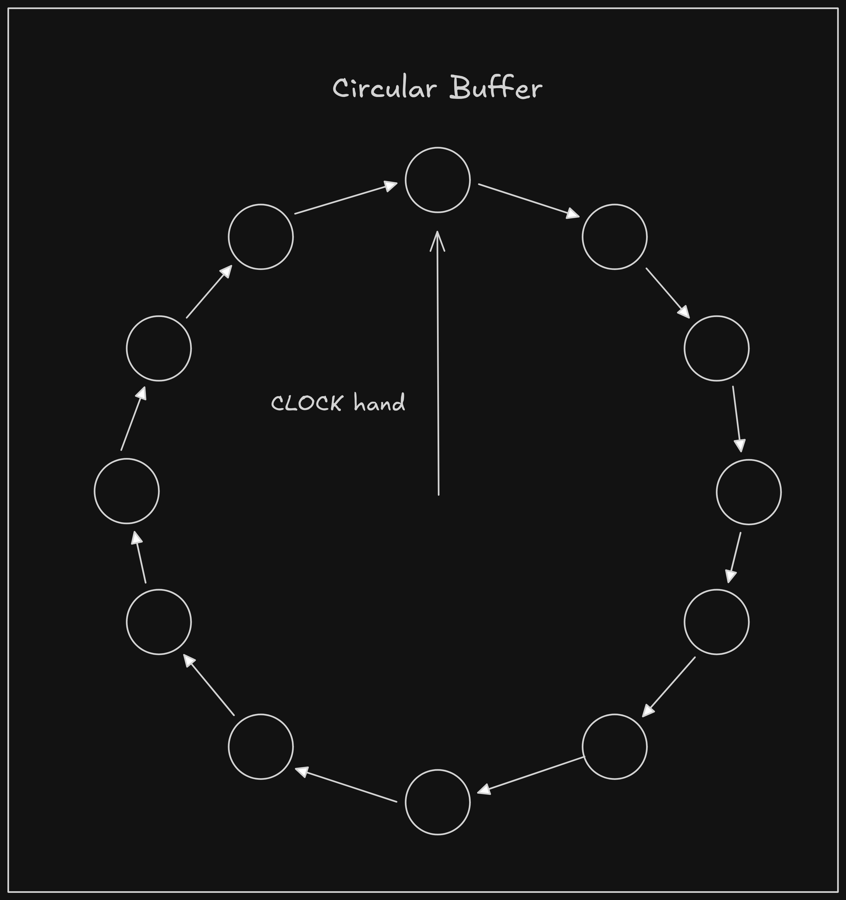

# CLOCK Replacement Algorithm - In Progress

This is an implementation of the CLOCK replacement algorithm popularly used in storage engines and databases such as PostgreSQL.

It is known for it's simplicity and high concurrency compared to LRU, an alternative cache eviction policy.

### 1. How it works

CLOCK replacement algorithm utilizes a circular buffer, arranged as a linked list,  with each item containing a reference bit and an access bit, and a clock hand that points to a a node in the linked list.



Each time a new item needs to be added and the cache is full, the clock hand checks the item it currently points to.

If the access bit is set, it proceeds to the next item. If access bit is not set, but reference bit is set, we unset the reference bit and proceed to the next item. This gives an item a "second chance". If both the access bit and reference bit are unset, the item hasn't been recently used and is evicted and the new item is added.

### 2. Drawbacks

CLOCK replacement algorithm is efficient but has  a relatively low hit-rate. This has given rise to optimizations to the CLOCK replacement algorithm like RockDB's **HyperClockCache** and **[Clock-Pro](https://www.usenix.org/legacy/event/usenix05/tech/general/full_papers/jiang/jiang.pdf)**, used in **[Pebble](https://github.com/cockroachdb/pebble/)** - CockroachDB's storage engine.

### 3. How to use

0. Ensure you have go installed. This package uses go version 1.24.2

1. install the package.

```go
go get github.com/oryankibandi/clock_replacement
```

2. Initialize the cache.

```go
import (
    cCache "github.com/oryankibandi/clock_replacement/pkg/cache"
)

options := cCache.CacheOptions{
    Capacity: 4 // Number of items. Each item is 8K in size.
}

c, err := cCache.NewCache(options)

if err != nil {
		panic("Unable to initialize cache")
}

defer c.Close()
```

You can pass your own implementation of a disk manager to retrieve and write page to and from the disk.

```go

options := cCache.CacheOptions{
    Capacity: 4,
    DManager: diskManager, 
}

c, err := cCache.NewCache(options) 
```

3: Add an entry.
```go

// add page data
_, err = c.Put(1, []byte("hello"))

if err != nil {
	log.Fatal(fmt.Errorf("Unable to add data to cache: %v", err))
}
```

4. Retrieve an entry.
```go
// retrieve page data
entry, err := c.Get(1)

if err != nil {
	log.Fatal(fmt.Errorf("Unable to retrieve data from cache"))
}
```

5. Unreference after use.
```go
// Unreference when done
entry.Unreference()
```

6. Once the cache is full, an item with both access bit and ref bit unset will have it's data flushed and evicted.
```go
// force eviction
cacheEntries := []struct {
	key   uint32
	value []byte
}{
	{key: 1, value: []byte("hello")},
	{key: 2, value: []byte("world")},
	{key: 3, value: []byte("cache")},
	{key: 4, value: []byte("eviction")},
}

for _, v := range cacheEntries {
	_, err = c.Put(v.key, v.value)

	if err != nil {
		log.Fatal(fmt.Errorf("Unable to add data to cache: %v", err))
	}
}

// cache is now full, to pin/reference items we retrieve them from the cache
for i, cEnt := range cacheEntries {
	if i == len(cacheEntries)-1 {
		// do not retrieve the last item
		break
	}
	_, err := c.Get(cEnt.key)

	if err != nil {
		log.Fatal(fmt.Errorf("Unable to add data to cache: %v", err))
	}
}

// now we add an extra item, which should cause one item, key 4 , to be evicted
_, err = c.Put(5, []byte("policies"))

if err != nil {
	log.Fatal(fmt.Errorf("Unable to add data to cache: %v", err))
}

// Try to retrieve item 4, should get an error
item_4, err := c.Get(4)

if item_4 != nil {
	log.Fatal("Item 4 not evicted")
}

slog.Error(fmt.Sprintf("Error from item_4: %v", err))// ERROR Error from item_4: Page Fault

```
